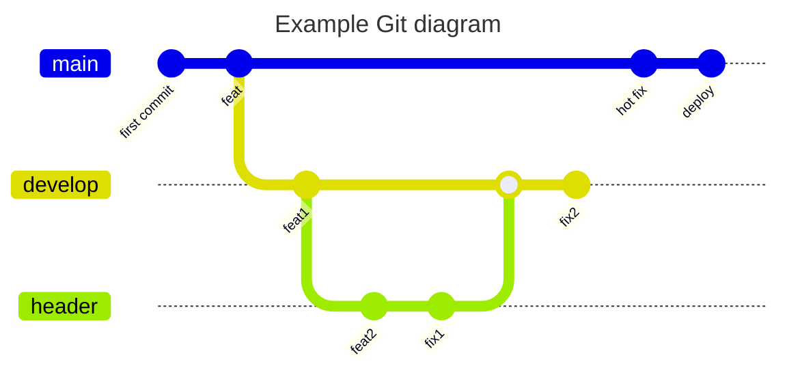

# werstack

[схема веток](#git-branch)

Сервис по разработке сайтов и веб-приложений, с подключением систем управлениям контентом (cms), взаимодействием с клиентами (crm) и каталогами товаров (e-com).

# git branch

[о лендинге](/about_landing.md)